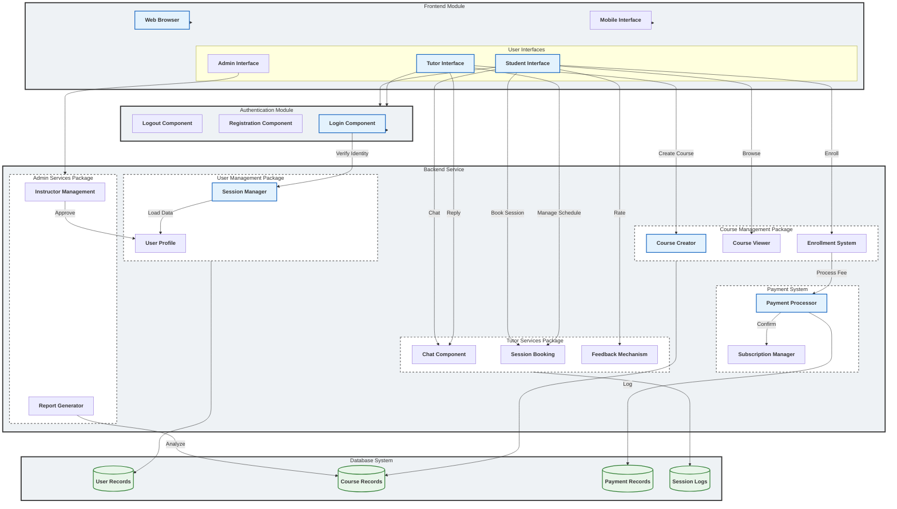

# ProSkill Academy - Component Diagram

This diagram describes the high-level modular structure of the system, showing how the Frontend, Authentication, Backend Services, and Database interact.

## Detailed Flow Description

1.  **Frontend Module**: The entry point for all users (Web/Mobile).
2.  **Authentication**: Users (Student/Tutor) authenticate via Login/Register components.
3.  **User Management**: Upon login, the Session Manager establishes context.
4.  **Course Management**: Students browse/view courses; Tutors create content.
5.  **Payment System**: Handles transactions when students enroll.
6.  **Tutor Services**: Facilitates booking, real-time chat, and quality feedback.
7.  **Admin Services**: Allows oversight of instructors and system reporting.
8.  **Database**: The final persistence layer for all modules.
