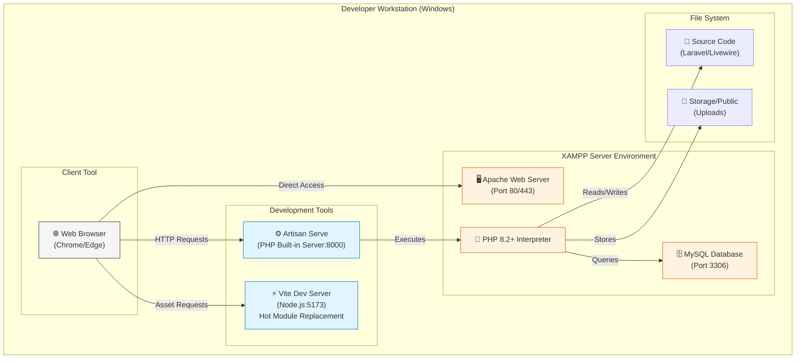
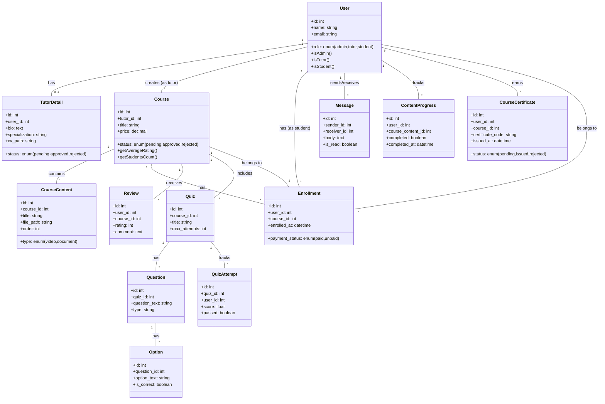
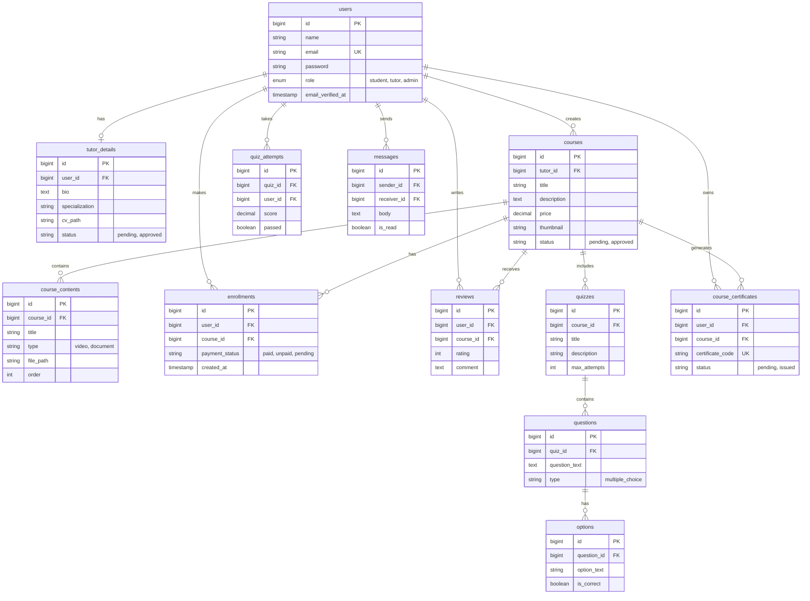
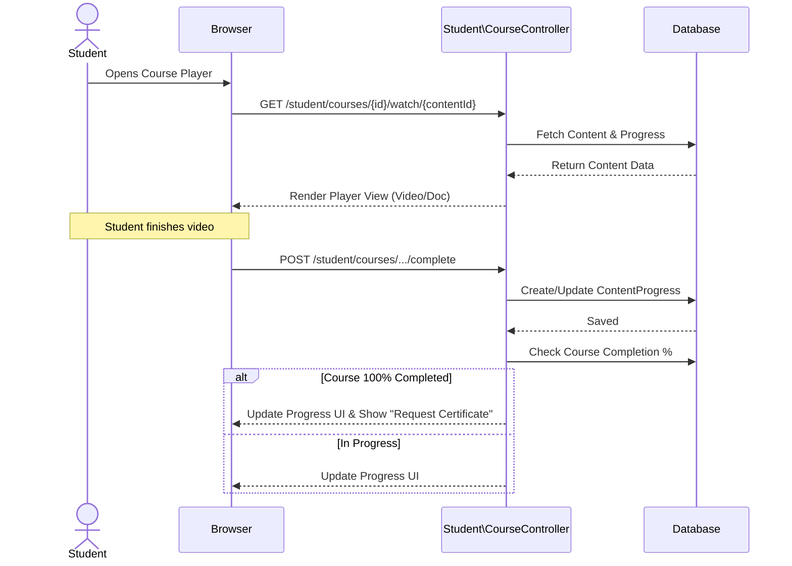

# ProSkill Academy - Technical Diagrams
## System Architecture Documentation

---

## 1. Component Diagram

This diagram reflects the actual modular structure of the **Laravel 12 + Livewire** application, organized by namespaces (Admin, Tutor, Student) and key services.

```mermaid
componentDiagram
    package "Frontend Module" {
        [Student Interface]
        [Tutor Interface]
        [Web Browser]
        [Mobile Interface]
    }

    package "Authentication Module" {
        [Login Component]
        [Registration Component]
        [Logout Component]
    }

    package "Backend Service" {
        package "User Management Package" {
            [Session Manager]
            [User Profile]
        }

        package "Course Management Package" {
            [Course Creator]
            [Course Viewer]
            [Enrollment System]
        }

        package "Payment System" {
            [Payment Processor]
            [Subscription Manager]
        }

        package "Tutor Services Package" {
            [Session Booking]
            [Chat Component]
            [Feedback Mechanism]
        }

        package "Admin Services Package" {
            [Instructor Management]
            [Report Generator]
        }
    }

    package "Database System" {
        [User Records]
        [Course Records]
        [Session Logs]
        [Payment Records]
    }

    %% Connections
    [Web Browser] --> [Frontend Module]
    [Frontend Module] --> [Authentication Module] : Login/Register

    [Authentication Module] --> [User Management Package] : Identity Verified
    [User Management Package] --> [Session Manager] : Manage Session

    [Student Interface] --> [Course Management Package] : Browse/Enroll
    [Course Management Package] --> [Payment System] : Initiate Payment
    [Payment System] --> [Course Management Package] : Confirm Access

    [Student Interface] --> [Tutor Services Package] : Book Session
    [Tutor Interface] --> [Tutor Services Package] : Manage Schedule
    [Chat Component] --> [Tutor Services Package] : Real-time Comm

    [Admin Services Package] --> [Course Management Package] : Quality Control
    [Admin Services Package] --> [Instructor Management] : Oversight

    [Backend Service] --> [Database System] : Store/Retrieve Data
```

### Key Modules Description

1.  **Localization Middleware**: Routes are prefixed with `{locale}` (ar/en) using `mcamara/laravel-localization`.
2.  **Student Module**: Handles course browsing, watching content (videos/docs), taking quizzes, and requesting certificates.
3.  **Tutor Module**: Allows creating courses, managing content (lessons), building quizzes, and updating tutor profile/CV.
4.  **Admin Module**: Focused on verification—approving pending courses and verifying new tutor registrations.
5.  **Livewire Components**: Handle dynamic, real-time features like Chat, Reviews, and Notifications without full page reloads.

---

## 2. Deployment Diagram

This diagram represents the current **local development environment** based on the XAMPP setup.



---

## 3. Class Diagram

This diagram reflects the actual **Eloquent Models** and their relationships found in `App\Models`.



---

## 4. Entity Relationship Diagram (ERD)

This diagram visualizes the exact database schema based on the **migration files**.



---

## 5. Sequence Diagrams

### 5.1. Course Content Watching & Progress



### 5.2. Quiz Attempt

```mermaid
sequenceDiagram
    actor Student
    participant Browser
    participant QuizCtrl as App\Http\Controllers\QuizController
    participant DB as Database

    Student->>Browser: Start Quiz
    Browser->>QuizCtrl: GET /student/quizzes/{id}
    QuizCtrl->>DB: Check Remaining Attempts
    
    alt Attempts Exceeded
        QuizCtrl-->>Browser: Error "Max attempts reached"
    else Attempts Available
        QuizCtrl-->>Browser: Show Quiz Form
    end

    Student->>Browser: Submit Answers
    Browser->>QuizCtrl: POST /student/quizzes/{id}
    QuizCtrl->>QuizCtrl: Calculate Score
    QuizCtrl->>DB: Save QuizAttempt
    
    auth Passed
        QuizCtrl->>DB: Mark as Passed
    else Failed
        QuizCtrl->>DB: Mark as Failed
    end

    QuizCtrl-->>Browser: Redirect to Results Page
```
